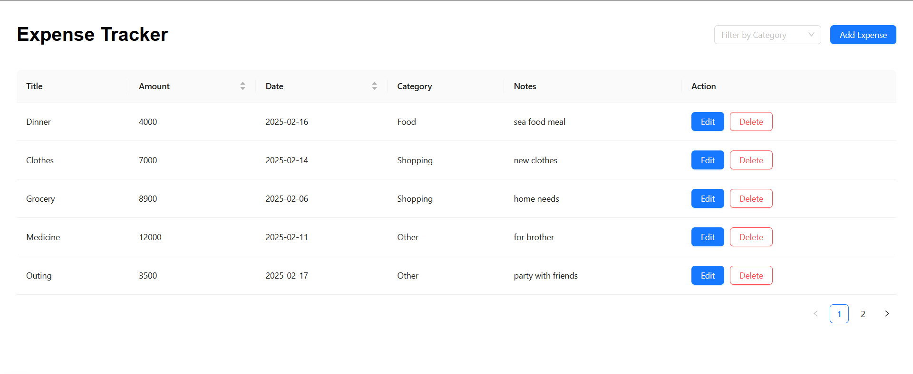

## Getting Started

This is an Expense Tracker web application built with Next.js, enabling users to manage their expenses seamlessly both online and offline.

API tests are implemented using Jest, and the code is formatted with Prettier for improved readability and maintainability.

## Overview



## Refer to the screenshots folder for additional interface previews and application behaviors

## Functionalities

1. Manage Expenses
2. Filter by Categories
3. Offline Mode (Auto Sync with Backend When Online)

## Getting Started

First, run

```bash
npm install
```

Second, run the development server:

```bash
npm run dev
```

Open [http://localhost:3000](http://localhost:3000) with your browser to see the result.
